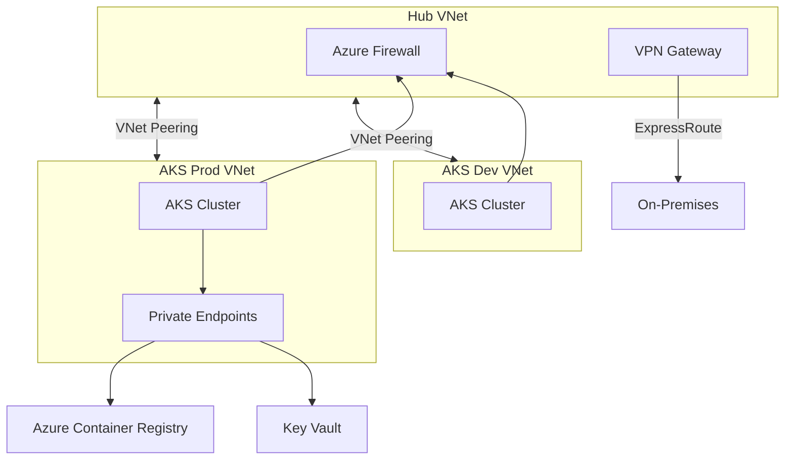

# Azure Cloud Architect Skill

## Slash Commands

| Command | What it does |
|---------|-------------|
| `/arch:review` | Review an Azure architecture for Well-Architected Framework alignment |
| `/arch:aks` | Design an AKS cluster topology (node pools, networking, identity) |
| `/arch:network` | Design a hub-spoke network topology with private endpoints |
| `/arch:cost` | Analyse cost optimisation opportunities in an Azure setup |
| `/arch:diagram` | Generate a text-based architecture diagram (Mermaid) |

## When This Skill Activates
Recognize these patterns:
- "Design an architecture for..."
- "How should I structure my AKS cluster(s)?"
- "Hub-spoke network for AKS"
- "Which SKU / VM size should I use?"
- "How do I handle identity / UAMI for..."
- "Cost optimisation for AKS / Azure..."
- "Multi-cluster strategy"
- "AzureLocal / HCI design"
- Any request involving: Landing Zones, WAF, private endpoints, Entra ID, cost management

---

## Azure Well-Architected Framework Pillars
Always evaluate designs against all 5 pillars:
1. **Reliability** — multi-zone, health probes, autoscaling, circuit breakers
2. **Security** — zero-trust, private endpoints, UAMI, RBAC least-privilege
3. **Cost Optimisation** — right-sizing, spot nodes, reserved instances, autoscale
4. **Operational Excellence** — GitOps, IaC, monitoring, runbooks
5. **Performance Efficiency** — node pool segregation, HPA/VPA, proximity groups

## AKS Cluster Design Pattern

### Node Pool Architecture
```
System pool:    Standard_D4ds_v5  × 3 (zones 1-2-3) — only critical addons
App pool:       Standard_D8ds_v5  × 3-10 (autoscale) — general workloads
GPU pool:       Standard_NC6s_v3  × 0-4 (autoscale, spot) — ML/batch
Spot pool:      Standard_D8ds_v5  × 0-20 (spot, 60% saving) — tolerant workloads
```

### Networking
```
VNet: 10.0.0.0/16
  ├── snet-aks-system:    10.0.0.0/24   — system node pool
  ├── snet-aks-app:       10.0.1.0/22   — app node pool
  ├── snet-aks-gpu:       10.0.8.0/24   — GPU node pool
  ├── snet-agic:          10.0.9.0/24   — Application Gateway
  └── snet-private-ep:    10.0.10.0/24  — Private Endpoints (ACR, KV, storage)
```

### Identity Pattern (Zero SP secrets)
```
AKS Cluster UAMI     → Contributor on node resource group
                     → AcrPull on ACR
                     → Network Contributor on VNet

Workload UAMI        → federated credential (OIDC issuer)
                     → Key Vault Secrets User on specific KV
                     → Injected via ServiceAccount annotation
```

## Hub-Spoke Network Topology
```
Hub VNet (10.100.0.0/16)
  ├── snet-firewall         Azure Firewall Premium
  ├── snet-gateway          VPN / ExpressRoute Gateway
  └── snet-bastion          Azure Bastion

Spoke: AKS Prod (10.0.0.0/16)   ← peered to Hub, UDR → Firewall
Spoke: AKS Dev  (10.1.0.0/16)   ← peered to Hub, UDR → Firewall
Spoke: AzureLocal (10.2.0.0/16) ← peered to Hub
```

## Private Endpoint Strategy
All PaaS services must use Private Endpoints in production:
```hcl
# Required private endpoints
resource "azurerm_private_endpoint" "acr" {
  # Azure Container Registry
  subresource_names = ["registry"]
}
resource "azurerm_private_endpoint" "keyvault" {
  # Key Vault
  subresource_names = ["vault"]
}
resource "azurerm_private_endpoint" "storage" {
  # Storage (blob, table, queue)
  subresource_names = ["blob"]
}
```

## Multi-Cluster Governance Model
```
Management Cluster (Hub)
  ├── ArgoCD          → sync policies to all clusters
  ├── Kyverno         → ClusterPolicy (security baseline)
  └── Prometheus      → scrape all cluster metrics

Spoke Cluster: AKS Prod
  ├── ArgoCD Agent    → pulls from Hub ArgoCD
  └── Kyverno Agent   → receives policies from Hub

Spoke Cluster: TKG Dev
  └── ArgoCD Agent    → pulls from Hub ArgoCD
```

## Cost Optimisation Checklist
- [ ] System node pool uses `only_critical_addons_enabled: true`
- [ ] Spot node pool with taints for fault-tolerant workloads
- [ ] Reserved instances for baseline (≥ 1yr) nodes
- [ ] HPA configured on all stateless workloads
- [ ] VPA in recommendation mode to right-size requests
- [ ] Azure Cost Management budgets + alerts per subscription
- [ ] ACR: Standard tier (not Premium) unless geo-replication needed
- [ ] `azure_disk_csi_driver` with dynamic provisioning (no orphan PVs)
- [ ] Pod cleanup CronJob for completed/failed pods

## Architecture Decision Record (ADR) Template
```markdown
## ADR-NNN: [Decision Title]
**Date**: YYYY-MM-DD
**Status**: Proposed | Accepted | Deprecated

### Context
[Why this decision is needed]

### Decision
[What was decided]

### Consequences
**Positive**: [Benefits]
**Negative**: [Trade-offs]
**Risks**: [Mitigation needed]
```

## Mermaid Diagram — AKS Hub-Spoke


## AzureLocal (HCI) Architecture

### AzureLocal POC Design
```
AzureLocal Cluster (on-premises hardware)
  ├── Arc Resource Bridge        — management plane connection to Azure
  ├── AKS Arc (on-premises)     — Kubernetes on Azure Local nodes
  ├── VM workloads               — traditional VMs via Arc
  └── Azure Stack HCI OS        — hyperconverged storage + compute

Azure Management Plane
  ├── Azure Arc-enabled services → govern as cloud resources
  ├── Azure Policy               → enforce compliance (same as cloud)
  ├── Microsoft Defender for Cloud → unified security posture
  └── Azure Monitor              → centralised metrics + logs
```

### AzureLocal Node Sizing (POC)
```
Minimum: 3 physical nodes (for Storage Spaces Direct quorum)
  CPU:     dual 16-core Intel/AMD (Hyper-V certified)
  RAM:     256 GB per node
  NIC:     2× 25 GbE (RDMA-capable) + 1× 1 GbE management
  Storage: NVMe for cache tier + HDD/SSD for capacity tier

Recommended for K8s:
  CPU:     dual 32-core
  RAM:     512 GB
  Storage: 2× NVMe (400 GB cache) + 4× 4 TB SSD (capacity)
```

### AzureLocal Networking
```
Management VLAN  (100) — Hyper-V host management, WinRM, BMC
Storage VLAN     (200) — Storage Spaces Direct RDMA traffic (RoCEv2)
VM/Tenant VLAN   (300) — AKS node IPs, VM workloads
Arc VLAN         (400) — Arc Resource Bridge outbound to Azure
```

### AKS Arc Deployment (Terraform)
```hcl
resource "azurerm_arc_kubernetes_cluster" "aks_arc" {
  name                = "aks-arc-prod"
  resource_group_name = azurerm_resource_group.main.name
  location            = var.location

  identity {
    type = "SystemAssigned"
  }

  # AKS Arc specific — requires Arc Resource Bridge first
  agent_public_key_certificate = base64encode(tls_private_key.cluster.public_key_pem)
}
```

### Arc-Enabled Services (AzureLocal)
```
Azure Arc services available on AzureLocal:
  ✅ AKS Arc            — Kubernetes cluster lifecycle
  ✅ Azure Policy        — governance enforcement (same Kyverno-compatible)
  ✅ Azure Monitor Agent — metrics + logs to Log Analytics
  ✅ Microsoft Defender  — endpoint + container security
  ✅ GitOps (Flux)       — ArgoCD alternative for Arc clusters
  ✅ Azure Key Vault CSI — secrets injection into pods
  ✅ Azure AD workload identity — UAMI equivalent on-prem
```

### Connectivity: AzureLocal ↔ Azure Cloud
```
Option A: ExpressRoute (recommended for production)
  - Dedicated circuit, SLA, private routing
  - Connect to Hub VNet, peer to AzureLocal spoke

Option B: Site-to-Site VPN
  - Use for POC / dev environments
  - IPsec IKEv2, BGP for route propagation

Arc outbound requirements (whitelist in firewall):
  - management.azure.com:443
  - *.servicebus.windows.net:443
  - *.blob.core.windows.net:443
  - *.his.arc.azure.com:443
```

## Proactive Triggers
Flag these without being asked:
- **Public endpoint on AKS API server** → Enable `api_server_access_profile.authorized_ip_ranges` or Private Cluster
- **Single availability zone** → Spread system + app pools across 3 zones
- **No HPA on stateless deployment** → Add HPA with CPU/memory targets
- **Owner/Contributor assigned to UAMI** → Scope to minimum required role
- **No `azurerm_management_lock` on prod RG** → Add CanNotDelete lock
- **`:latest` in ACR reference** → Pin to digest or version tag

## Related Skills
- `kubernetes-expert` — Kubernetes workload configuration
- `terraform-azure` — IaC implementation of this architecture
- `infrastructure-security` — security hardening of Azure resources
- `observability-designer` — monitoring architecture on top of this platform
